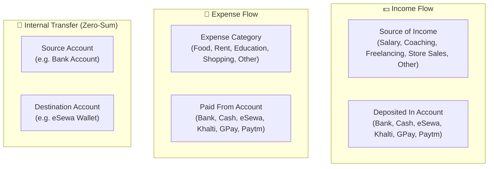

# 📋 Expense Tracker — Project Overview & Architecture Guide

> **Problem Statement**: Expense Tracker Python Web Application Using Django & React 19  
> **Domain**: Web Application, Django REST Framework, PostgreSQL, Prisma ORM, React 19  
> **Application Name**: FinanceOS — Personal Finance & Multi-Wallet Money Manager  

---

## 1. Project Description

FinanceOS is a modern, full-stack personal finance web application built with **Django 5.x REST Framework**, **Supabase PostgreSQL**, **Prisma ORM**, and **React 19**. It provides real-time financial tracking, budget threshold monitoring, universal calendar filtering, multi-format exports (PDF & CSV), and complete live synchronization across categories, income streams, and payment wallets.

---

## 2. Technology Stack

| Layer | Technology | Version | Purpose |
|---|---|---|---|
| **Frontend Framework** | React 19 | 19.2.8 | Reactive component-based UI with Hooks & Context |
| **Build Tool** | Vite | 8.2.1 | Ultra-fast HMR and bundle optimization |
| **Language** | TypeScript | 6.0.3 | Strict end-to-end type safety |
| **Styling** | Tailwind CSS | 4.3.3 | CSS utility design system with OKLCH color tokens |
| **UI Primitives** | Radix UI | 1.6.7 | Accessible dialogs, selects, tabs, and dropdowns |
| **Animations** | Motion (Framer Motion) | 12.43.0 | Smooth micro-animations and layout transitions |
| **Charts** | Recharts | 3.10.1 | Responsive Area, Bar, and Trend visualizations |
| **Backend Framework** | Django 5.x REST Framework | 5.x | Python web API backend with Class-Based Views |
| **Database** | Supabase PostgreSQL | 16+ | Cloud relational database with UUID keys & foreign constraints |
| **ORM** | Prisma ORM | 0.15.0 | Type-safe Python client & database schema management |
| **Authentication** | Django JWT + Supabase Auth | 2.112.4 | Token authentication & direct email verification |
| **Date Handling** | date-fns | 4.4.0 | Date math, calendar intervals, and formatting |
| **Toast Notifications** | Sonner | 2.0.8 | Real-time action feedback toasts |

---

## 3. Dynamic Metadata & CRUD Architecture

Every financial classification in FinanceOS is fully dynamic and stored in PostgreSQL:

### 🖼️ Image & Logo Specifications

| Media Asset | Aspect Ratio | Dimensions | Maximum Size | Allowed Formats | Processing |
| :--- | :--- | :--- | :--- | :--- | :--- |
| **Category / Wallet Logo** | **1:1 Square** | `120 × 120 px` | $\le 50\text{ KB}$ | `.png`, `.jpg`, `.jpeg`, `.svg`, `.webp` | HTML5 Canvas Center-Crop & Compress |
| **Bill / Receipt Attachment** | Natural / 4:3 | $\le 800\text{ px}$ width | $\le 100\text{ KB}$ | `.png`, `.jpg`, `.jpeg`, `.webp` | Client-Side Canvas Compression |

---

## 4. Mathematical Calculations & Accounting Logic

### A. Net Cash Flow
$$\text{Net Cashflow} = \sum (\text{Filtered Completed Income}) - \sum (\text{Filtered Completed Expenses})$$

### B. Internal Transfer Integrity (Zero-Sum)
$$\Delta \text{Net Worth}_{\text{Transfer}} = 0$$
Transfers reallocate funds between internal wallets (e.g. Bank to eSewa) and are excluded from income/expense calculations.

### C. Budget Threshold Alerting
$$\text{Status} = \begin{cases} 
\text{Healthy (Green)}, & \text{if } \frac{\text{Spent}}{\text{Budget Limit}} < 0.75 \\
\text{Warning (Amber)}, & \text{if } 0.75 \le \frac{\text{Spent}}{\text{Budget Limit}} < 1.00 \\
\text{Over Budget (Red)}, & \text{if } \frac{\text{Spent}}{\text{Budget Limit}} \ge 1.00
\end{cases}$$

---

## 5. Cross-Document Navigation

* 📖 [02. UI/UX Design System](02-UI-UX-DESIGN-SYSTEM.md)
* 📖 [06. Search, Dynamic Filters & Calendar Engine](06-FILTERS-SEARCH-SORTING-CALENDAR.md)
* 📖 [08. Full Stack System Architecture](08-SYSTEM-ARCHITECTURE.md)
* 📖 [09. Actions, Modals & Toast Interaction Catalog](09-ACTIONS-INTERACTIONS-CATALOG.md)
* 📖 [10. Django PostgreSQL Implementation Guide](10-DJANGO-POSTGRESQL-PRISMA-IMPLEMENTATION-GUIDE.md)
* 📖 [12. Settings, Security & Device Tracking](12-SETTINGS-SECURITY-DEVICE-TRACKING.md)
* 📖 [Documentation Index](README.md)
