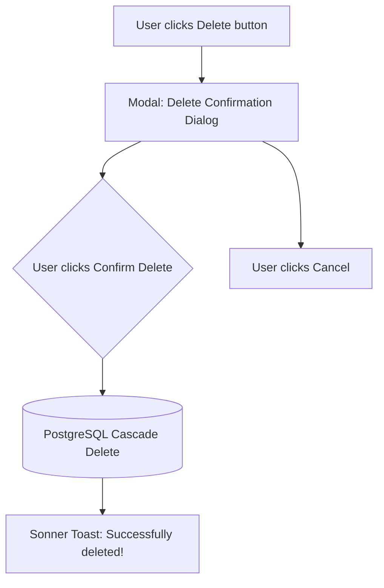

# 09. Actions, Modals & Toast Interaction Catalog

This document provides a comprehensive catalog of all user actions, CRUD modal interfaces, real-time feedback toasts, and confirmation dialogs across FinanceOS.

---

## 📑 Table of Contents
1. [Interaction Principles](#1-interaction-principles)
2. [Dynamic Category & Account CRUD](#2-dynamic-category--account-crud)
3. [Transaction Modal Interface](#3-transaction-modal-interface)
4. [Universal Confirmation Dialogs](#4-universal-confirmation-dialogs)
5. [Toast Notification Catalog](#5-toast-notification-catalog)
6. [Cross-Document Navigation](#6-cross-document-navigation)

---

## 1. Interaction Principles

* **Optimistic UI Updates**: Any addition, edit, or deletion reflects instantly on the UI while syncing asynchronously with Django REST APIs and PostgreSQL.
* **Auto 1:1 Aspect Ratio Cropping**: All uploaded icons and logos are automatically center-cropped to `120x120px` ($< 50\text{ KB}$) in the browser before dispatch.
* **Automatic Dropdown Synchronization**: When a Category, Income Stream, or Payment Wallet is added, updated, or deleted, every dropdown across the app refreshes immediately.

---

## 2. Dynamic Category & Account CRUD

### A. Expense / Category Modal (`CategoryFormModal`)
* **Category Name \***: *e.g., Groceries, Rent, Education, Shopping*
* **Classification**: `Expense (-)`, `Income (+)`, `Transfer (0)`
* **Icon / Logo (1:1 Ratio)**: Switch between Emoji Picker or Custom Logo Upload
* **Color Badge**: Hex color palette selector

### B. Income Stream Modal (`IncomeSourceFormModal`)
* **Income Stream Name \***: *e.g., Monthly Salary, Math Coaching, Freelance Web, Business Sales*
* **Classification**: `Salary`, `Freelance`, `Business`, `Investment`, `Other`
* **Icon / Logo (1:1 Ratio)**: Emoji Picker or Custom Uploaded 1:1 Logo
* **Color Badge**: Hex color palette selector

### C. Payment Account / Wallet Modal (`PaymentMethodFormModal`)
* **Account / Wallet Name \***: *e.g., eSewa, Khalti, HDFC Bank, GPay, Paytm, Cash*
* **Account Type**: `Digital Wallet`, `Bank Account`, `UPI App`, `Card`, `Cash`
* **Last 4 Digits (Optional)**: Displayed for Cards and Bank accounts
* **Initial Balance (₹) (Optional)**: Starting ledger liquidity
* **Icon / Logo (1:1 Ratio)**: Emoji or Custom Uploaded 1:1 Logo

---

## 3. Transaction Modal Interface (`TransactionFormModal`)

* **Expense Form**:
  - Title, Amount (₹), Date & Time
  - Expense Category dropdown (dynamically synced)
  - Paid From Account dropdown (dynamically synced)
  - Status (`Completed`, `Pending`, `Failed`)
  - Bill / Receipt attachment ($\le 100\text{ KB}$) with full-screen viewer
  - Notes / Remarks
* **Income Form**:
  - Title, Amount (₹), Date & Time
  - Source of Income dropdown (dynamically synced)
  - Deposited In Account dropdown (dynamically synced)
  - Status (`Completed`, `Pending`, `Failed`)
  - Deposit slip attachment ($\le 100\text{ KB}$) with full-screen viewer
  - Notes / Remarks
* **Transfer Form**:
  - Description, Amount (₹), Date & Time
  - From Source Account dropdown (dynamically synced)
  - To Destination Account dropdown (dynamically synced)
  - Zero-Sum Information Banner
  - Status (`Completed`, `Pending`, `Failed`)
  - Notes / Remarks

---

## 4. Universal Confirmation Dialogs

---

## 5. Toast Notification Catalog

| Trigger Event | Toast Type | Message Content |
| :--- | :--- | :--- |
| **Add Transaction** | `toast.success` | `"Transaction saved successfully!"` |
| **Edit Transaction** | `toast.success` | `"Transaction updated in database!"` |
| **Delete Transaction** | `toast.success` | `"Transaction deleted from database!"` |
| **Add Category** | `toast.success` | `"Category created in database!"` |
| **Add Income Stream** | `toast.success` | `"Income stream created in database!"` |
| **Add Payment Account** | `toast.success` | `"Payment account created in database!"` |
| **Logo Auto-Crop** | `toast.success` | `"Logo auto-cropped to 1:1 square (< 50 KB)!"` |
| **Receipt Compress** | `toast.success` | `"Receipt attached & compressed (XX KB ≤ 100 KB)!"` |
| **Export Excel/CSV** | `toast.success` | `"Financial statement exported to Excel / CSV!"` |
| **Export PDF** | `toast.success` | `"Generating formal printable PDF statement…"` |
| **Profile Save** | `toast.success` | `"Profile & regional preferences saved to database!"` |
| **Terminate Session** | `toast.success` | `"Device session terminated successfully!"` |
| **Remote Logout All** | `toast.success` | `"Logged out from all other active devices!"` |

---

## 6. Cross-Document Navigation

* 📖 [01. Project Overview & Math Logic](01-PROJECT-OVERVIEW.md)
* 📖 [06. Search, Dynamic Filters & Calendar Engine](06-FILTERS-SEARCH-SORTING-CALENDAR.md)
* 📖 [08. Full Stack System Architecture](08-SYSTEM-ARCHITECTURE.md)
* 📖 [12. Settings, Security & Device Tracking](12-SETTINGS-SECURITY-DEVICE-TRACKING.md)
