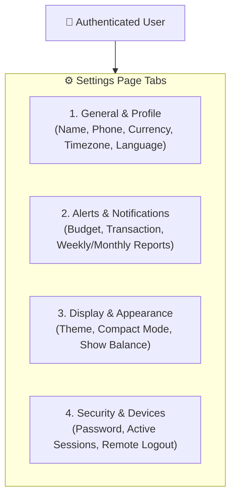

# 12. Settings, Security & Real-Time Device Tracking Architecture

This document describes the complete implementation of **User Settings, Security Controls, Regional Preferences, and Active Device / Session Tracking** in FinanceOS.

---

## 📑 Table of Contents
1. [Module Overview](#1-module-overview)
2. [Database Schema (`user_settings` & `users`)](#2-database-schema)
3. [REST API Endpoints](#3-rest-api-endpoints)
4. [Active Device & Multi-Session Tracking Architecture](#4-active-device--multi-session-tracking-architecture)
5. [Mathematical & Logical Rules](#5-mathematical--logical-rules)
6. [Cross-Document Navigation](#6-cross-document-navigation)

---

## 1. Module Overview

The Settings page (`/settings`) provides an administrative dashboard for users to control their entire financial application experience across 4 specialized tabs:



---

## 2. Database Schema

Stored directly in **Supabase PostgreSQL** via Prisma:

```prisma
model UserSettings {
  id                String   @id @default(uuid())
  userId            String   @unique
  budgetAlerts      Boolean  @default(true)
  transactionAlerts Boolean  @default(true)
  weeklyReport      Boolean  @default(true)
  monthlyReport     Boolean  @default(false)
  securityAlerts    Boolean  @default(true)
  emailDigest       Boolean  @default(false)
  compactMode       Boolean  @default(false)
  showBalance       Boolean  @default(true)
  animations        Boolean  @default(true)
  theme             String   @default("system")
  createdAt         DateTime @default(now())
  updatedAt         DateTime @updatedAt
  user              User     @relation(fields: [userId], references: [id], onDelete: Cascade)
}
```

---

## 3. REST API Endpoints

| Method | Endpoint | Description | Request Body | Response |
| :--- | :--- | :--- | :--- | :--- |
| `GET` | `/api/auth/profile/` | Fetch user profile and preferences | None | User object + settings JSON |
| `PUT` | `/api/auth/profile/` | Update profile, currency, language, timezone | `{ name, phone, currency, timezone, language }` | Updated profile |
| `PUT` | `/api/auth/settings/` | Update notification and display toggles | `{ budgetAlerts, compactMode, ... }` | Success response |
| `POST` | `/api/auth/change-password/` | Update account password | `{ currentPassword, newPassword }` | 200 OK |
| `GET` | `/api/auth/sessions/` | List all active logged-in devices | None | `{ sessions: [...] }` |
| `POST` | `/api/auth/sessions/` | Terminate specific or all other devices | `{ action: "revoke_all_others" }` | 200 OK |

---

## 4. Active Device & Multi-Session Tracking Architecture

When a user logs in, Django captures the client metadata:
1. **IP Address**: Extracted from `request.META['REMOTE_ADDR']` / `HTTP_X_FORWARDED_FOR`.
2. **User-Agent String**: Parsed into Client OS (Windows, macOS, iOS, Android, Linux) and Browser (Chrome, Safari, Firefox, Edge).
3. **Session ID & Status**: Active devices are displayed with a live status indicator (`This Device` vs `Remote Device`).
4. **Remote Revocation**: Users can click **"Log Out Device"** to terminate a single rogue device or click **"Log Out of All Other Devices"** to kill all other active tokens immediately.

---

## 5. Mathematical & Logical Rules

### Currency Localization
When changing the primary currency in settings (e.g. from `INR` to `USD` or `EUR`), all calculations on the Dashboard and Transactions page dynamically adapt:
$$\text{Formatted Currency} = \text{Symbol} + \text{NumberFormat}(\text{Amount}, \text{Locale})$$

### Budget Notification Threshold Rule
$$\text{Alert Condition} = \begin{cases} 
\text{Warning Toast}, & \text{if } \text{Spent} \ge 0.75 \times \text{Budget Limit} \land \text{budgetAlerts} = \text{true} \\
\text{Critical Danger Alert}, & \text{if } \text{Spent} \ge 1.00 \times \text{Budget Limit} \land \text{budgetAlerts} = \text{true} \\
\text{Suppressed}, & \text{if } \text{budgetAlerts} = \text{false}
\end{cases}$$

---

## 6. Cross-Document Navigation

* 📖 [01. Project Overview](01-PROJECT-OVERVIEW.md)
* 📖 [06. Filters, Search, Sorting & Calendar](06-FILTERS-SEARCH-SORTING-CALENDAR.md)
* 📖 [08. System Architecture](08-SYSTEM-ARCHITECTURE.md)
* 📖 [10. Django PostgreSQL Implementation Guide](10-DJANGO-POSTGRESQL-PRISMA-IMPLEMENTATION-GUIDE.md)
* 📖 [11. API Specification Contract](11-API-SPECIFICATION-CONTRACT.md)
