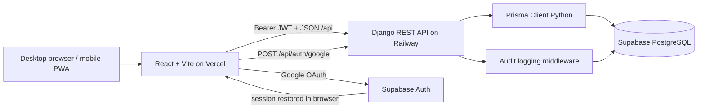
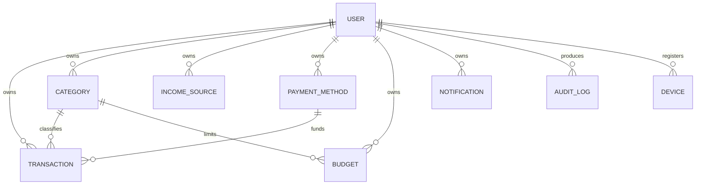
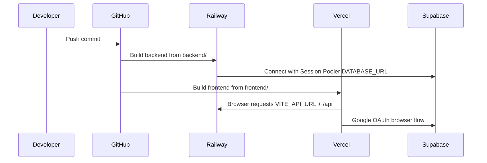

# FinanceOS Complete System Reference

> **Status:** implementation reference, updated 2026-08-26. This document describes the behavior implemented in the repository. It is the source of truth for routes, user actions, data ownership, filtering, CRUD, and deployment.

## 1. Mission, vision, and product goal

**Mission:** help an individual record, understand, and manage personal financial activity from any signed-in device.

**Vision:** a mobile-friendly personal financial workspace whose records belong to the user account and persist in cloud PostgreSQL, not in a particular browser.

**Product goal:** provide a complete financial loop: authenticate → create categories/accounts → record income, expenses, and transfers → set budgets → inspect analytics → export reports → review account/security activity.

## 2. System map



### Runtime responsibilities

| Layer | Responsibility |
|---|---|
| React/Vite | SPA routes, forms, charts, local view state, client-side search/filter/sort, CSV/PDF generation, PWA shell. |
| Supabase Auth | Google OAuth identity and browser session. |
| Django REST | account registration/login, app JWT issuance, authenticated REST endpoints, server-side ownership checks. |
| Prisma/PostgreSQL | durable user, transaction, category, income-source, payment-method, budget, notification, device, and audit data. |
| Railway | builds/runs the Django container using Gunicorn on port 8080. |
| Vercel | builds/serves the frontend and routes `/api/*` to Railway when the rewrite is deployed. |

## 3. Account and synchronization rules

1. Email/password registration and login use Django endpoints and return app JWT access/refresh tokens.
2. Google uses Supabase OAuth. After redirect, `AuthProvider` submits the Google profile to `/api/auth/google/`, receives the same app JWT format, and loads the app user.
3. `TransactionProvider` waits for an authenticated `user.id`, then reloads transactions and metadata from the API. It reloads again whenever the signed-in account changes.
4. PostgreSQL is the source of truth. Browser localStorage is only a display cache; successful API responses replace it, including an empty server result.
5. Mutations are cloud-first: a failed create/update/delete shows an error and is not presented as a saved local record.
6. Every record query is scoped by the JWT user ID. Detail mutation endpoints additionally verify the record owner.

## 4. Navigation, layout, and common controls

### Desktop sidebar

| Icon | Destination | Route |
|---|---|---|
| `LayoutDashboard` | Home | `/` |
| `ArrowLeftRight` | Transactions | `/transactions` |
| `TrendingUp` | Income | `/income` |
| `TrendingDown` | Expenses | `/expenses` |
| `Repeat2` | Transfers | `/transfers` |
| `Target` | Budget | `/budget` |
| `Tag` | Categories | `/categories` |
| `BarChart3` | Analytics | `/analytics` |
| `FileText` | Reports | `/reports` |
| `Bell` | Notifications | `/notifications` |
| `User` | Profile | `/profile` |
| `Settings` | Settings | `/settings` |
| `Shield` | Audit logs | `/audit-logs` |
| `Download` | PWA installation dialog | n/a |
| `LogOut` | Sign out | n/a |

The desktop sidebar can collapse. The mobile bottom bar exposes Home, Transactions, Income, Expenses, and Profile; the full sidebar is available through the mobile drawer.

### Shared date/calendar filter

`CalendarFilter` is used by Transactions, Income, Expenses, Transfers, Reports, and Audit Logs.

- Quick presets: All, Today, Yesterday, last 7 days, and This Month.
- Custom modal: range, single-day, and multiple-day modes.
- Controls: previous/next month, Clear, Apply Filter, and reset (`X`).
- `matchesCalendarFilter()` applies the chosen selection to the displayed records.

### Shared export behavior

- **CSV:** client-side CSV/Excel-compatible download, containing report metadata and current filtered rows.
- **PDF:** opens a printable, styled HTML statement in a new window and invokes browser print/save-to-PDF.
- Exports always reflect the current page filters rather than all historic records.

## 5. Page-by-page reference

### Authentication pages

| Route | Fields and actions | Cloud behavior |
|---|---|---|
| `/sign-in` | email, password, password visibility; Sign In; Continue with Google; Forgot password link | `POST /auth/login/`; Google invokes Supabase then Django sync. |
| `/sign-up` | name, email, password, password visibility; Google; Create account | `POST /auth/register/`. Duplicate email returns an error. |
| `/forgot-password` | email; send code | Supabase request may be attempted and Django receives `POST /auth/forgot-password/`. |
| `/verify-otp` | six-digit code; Verify; Resend | `POST /auth/verify-otp/` and resend to `/auth/forgot-password/`. |
| `/reset-password` | new password, confirmation, visibility controls | `POST /auth/reset-password/`. |
| `/auth/callback` | loading/error/retry interface | reserved callback route; normal Supabase redirect targets the application origin. |

### Home dashboard (`/`)

- KPI cards for current-period income, expense, available balance, and transaction activity.
- Recent transaction list, monthly/period summaries, budget progress, and notification badge.
- **Add Transaction** opens the shared transaction form.
- Bell opens Notifications; dashboard requests budgets and notifications in addition to transaction-store data.

### Transactions (`/transactions`)

**Purpose:** universal ledger for income, expense, and transfer records.

- Tabs: All, Income, Expenses, Transfers; changing tab resets tab-specific filters.
- Search: debounced title, notes, category/source, tags, and amount matching.
- Filters: date/calendar, category, income source, payment method, and status.
- Sort: date, amount, or title, with ascending/descending direction.
- Actions: CSV export, PDF export, Add Transaction, reset filters, open a row, edit, duplicate, and delete confirmation.
- Form fields: type, title/description, amount, date, time, expense category or income source, payment/deposit account, transfer source/destination accounts, status, receipt image URL/upload state, notes, and tags.
- CRUD uses `/api/transactions/`, `/api/transactions/:id/`, and `/api/transactions/:id/duplicate/`.

### Income (`/income`)

- Shows only `income` transactions plus period totals and monthly visualizations.
- Search, calendar, source, deposit account, status, and sort controls (date, amount, title/direction).
- Add Income uses the shared transaction form with income source and deposit account inputs.
- CSV/PDF exports include the filtered income set.

### Expenses (`/expenses`)

- Shows only `expense` transactions, completed-expense total, category distribution, and monthly trend data.
- Search matches description, category, account, tags, and amount.
- Filters: calendar, category, payment account, status; sortable by date, amount, or title.
- Clicking a category chip applies/removes that category filter.
- Add Expense, row detail/edit/delete, and filtered CSV/PDF export use the shared transaction functionality.

### Transfers (`/transfers`)

- Shows only `transfer` transactions and totals for completed/pending transfers.
- Search, calendar, account, status, and date/amount sorting.
- The form presents From Account and To Account fields. Destination is represented in transaction tags in the UI (`to:<methodId>`).
- CSV/PDF export is filtered; add/edit/delete use transaction CRUD.

### Budget (`/budget`)

- Budget cards show limit, live completed-expense spending, remaining amount, and progress state.
- Period tabs: all, weekly, monthly, yearly.
- Add/Edit form fields: expense category, period, and limit amount. Start/end dates are computed for a new monthly budget.
- Actions: Create, edit (`Pencil`), delete (`Trash2`) with confirmation.
- API: `GET/POST /api/budgets/`, `PUT/DELETE /api/budgets/:id/`.
- A category must exist before a budget can be created.

### Categories, Income Sources, and Payment Methods (`/categories`)

This page uses three tabs and a shared search plus refresh control.

| Tab | Create/edit fields | CRUD API |
|---|---|---|
| Categories | name, type, emoji/image icon, color | `/api/categories/` and `/:id/` |
| Income sources | name, source type, emoji/image icon, color, monthly average | `/api/income-sources/` and `/:id/` |
| Payment methods | account name, account type, icon/image, optional last four digits, opening balance | `/api/payment-methods/` and `/:id/` |

- Actions: Add, Edit (`Pencil`), Delete (`Trash2`) with confirmation, upload/select icon, and Refresh from database.
- Refresh replaces the on-device metadata with the current account’s cloud records. It is the recovery action for stale browser cache.

### Analytics (`/analytics`)

- Calculates from the authenticated transaction-store dataset.
- Period selector controls the analysis window.
- Chart selector changes displayed chart type.
- Views include cash-flow trend, spending category breakdown, income contribution, and budget-versus-spend style summaries where underlying records exist.
- It is read-only: no CRUD endpoint is called by the page.

### Reports (`/reports`)

- Financial statement table and income/expense/net summary cards.
- Filters: calendar, transaction type, category, payment method, status.
- Table heading clicks sort date, title, and amount; sort direction toggles.
- Actions: Export CSV and Export PDF for current result set.
- The backend additionally exposes `/api/reports/export/csv/` for a server-generated account-scoped CSV, although the page currently uses the client export helper.

### Notifications (`/notifications`)

- Splits notifications into unread/read groups and counts unread items.
- Actions: mark one read, mark all read, dismiss, and clear all.
- Backend supports list/create and mark-read behaviors; confirm backend semantics before treating dismiss/clear as durable deletion because the current page also updates local view state.

### Profile (`/profile`)

- Displays account identity, avatar/image preview and zoom, email, phone, currency, timezone/language/date preferences, and lifetime transaction totals.
- Edit fields: name, phone, currency, timezone, language, date format, avatar.
- Security/devices: refresh active sessions, revoke one session, or revoke all other sessions.
- API: `GET/PUT /api/auth/profile/`, `GET/POST /api/auth/sessions/`.

### Settings (`/settings`)

- Account settings/profile settings and notification/preferences switches.
- Includes appearance controls, profile update, password-change form, and active-session controls.
- API: profile `PUT /api/auth/profile/`, preferences `PUT /api/auth/settings/`, password `POST /api/auth/change-password/`, sessions `GET/POST /api/auth/sessions/`.

### Audit logs (`/audit-logs`)

- Loads account-scoped mutation history from `/api/audit-logs/`.
- Search: action, module/entity, browser, or IP.
- Filters: calendar, module, and outcome (success/failure/warning).
- Actions: Refresh, reset filters, export CSV/PDF, open an event details dialog.
- Django audit middleware records POST/PUT/PATCH/DELETE API mutations with action mapping, device/browser/OS, IP, result, and timestamp.

### Other routes

- `/Index` is a legacy/entry page implementation; `App.tsx` routes the product home to `/`.
- `*` renders Not Found.

## 6. Data model and CRUD ownership



| Entity | Key fields | CRUD |
|---|---|---|
| User | id, email, name, password hash, currency, timezone, language | register/login; profile/settings/password updates |
| Transaction | type, title, amount, date/time, category, payment method, notes, status, tags | list/create/detail/update/delete/duplicate |
| Category | name, icon, color, type | list/create/update/delete |
| IncomeSource | name, type, icon, color, monthly average | list/create/update/delete; mirrored to category for transaction compatibility |
| PaymentMethod | name, type, icon, last4, balance | list/create/update/delete |
| Budget | category, period, limit, start/end | list/create/update/delete |
| Notification | title, message, type, read, timestamp | list/create/mark read |
| AuditLog | action, entity, device, browser, OS, IP, result, timestamp | generated/listed, not edited by the app |

## 7. REST endpoint inventory

| Group | Endpoints |
|---|---|
| Health | `GET /` |
| Auth | `POST /api/auth/register/`, `/login/`, `/google/`, `/refresh/`, `/forgot-password/`, `/verify-otp/`, `/reset-password/`, `/change-password/`; `GET/PUT /profile/`; `PUT /settings/`; `GET/POST /sessions/` |
| Transactions | `GET/POST /api/transactions/`; `GET/PUT/DELETE /api/transactions/:id/`; `POST /:id/duplicate/` |
| Categories | `GET/POST /api/categories/`; `PUT/DELETE /api/categories/:id/` |
| Income sources | `GET/POST /api/income-sources/`; `PUT/DELETE /api/income-sources/:id/` |
| Payment methods | `GET/POST /api/payment-methods/`; `PUT/DELETE /api/payment-methods/:id/` |
| Budgets | `GET/POST /api/budgets/`; `PUT/DELETE /api/budgets/:id/` |
| Analytics | `GET /api/analytics/overview/`, `/summary/`, `/monthly-trend/` |
| Reports | `GET /api/reports/export/csv/` |
| Notifications | `GET/POST /api/notifications/`; mark-read variants |
| Audit | `GET /api/audit-logs/` |

## 8. Deployment and environment reference

### Production flow



### Railway (backend)

- Root directory: `backend`; Dockerfile installs dependencies, generates Prisma client, and runs `start.sh`.
- Gunicorn listens on Railway’s `PORT` (normally 8080).
- **Required:** `DATABASE_URL` must be the exact Supabase **Session pooler** URL with a real database password, not a placeholder. A direct `db.<ref>.supabase.co:5432` endpoint may fail from IPv4-only hosting.
- Set strong `SECRET_KEY` and `JWT_SECRET_KEY`; use `DEBUG=False` in production.
- Configure allowed CORS origins to the Vercel production domain in a hardened production configuration.

### Vercel (frontend)

- Root directory: `frontend`; framework: Vite.
- Required production variables:

```env
VITE_API_URL=https://expensive-tracker-backend-production.up.railway.app/api
VITE_SUPABASE_URL=https://pbfxcabqqaboqejcgjkx.supabase.co
VITE_SUPABASE_PUBLISHABLE_KEY=sb_publishable_...
```

- Never expose a Supabase `service_role` key through any `VITE_*` variable.
- `frontend/vercel.json` maintains the SPA fallback and API rewrite.

### Supabase and Google OAuth

- Enable Google under Authentication → Sign In / Providers.
- Supabase Site URL: `https://expensive-tracker-chi-three.vercel.app`.
- Redirect allow-list includes the production URL and development URL(s).
- In Google Cloud OAuth client settings, authorize: `https://pbfxcabqqaboqejcgjkx.supabase.co/auth/v1/callback`.
- Rotate any credentials that were shown in screenshots, logs, chat, commits, or client code.

## 9. Operational verification checklist

1. Open Railway root health URL; confirm HTTP 200.
2. Inspect Railway logs: no `P1000`/`P1001` Prisma connection errors.
3. Sign in on desktop; create a category and transaction.
4. Open the same account on mobile; refresh Categories and confirm the cloud records appear.
5. Update/delete a record on mobile; verify the desktop reload reflects it.
6. Test each filter, calendar preset/custom range, sort toggle, CSV, and PDF export.
7. Check `/audit-logs` for the mutation and `/profile` or `/settings` for session behavior.
8. Test Google OAuth in a private/incognito window.

## 10. Known implementation boundaries

- Filters, charts, and most exports operate client-side on the fetched account dataset; they do not currently drive server-side paginated queries.
- Local browser cache is a convenience layer only and can be cleared safely after a successful cloud sync.
- Notifications page contains local dismissal/clear UI behavior; align it with explicit backend delete endpoints before promising durable notification deletion.
- Transfer destination is represented by UI metadata/tags; account balance movement is not implemented as a separate double-entry ledger operation in the current transaction API.
- The project retains older Convex/Hercules and mock-data artifacts. The active product data path is React → Django → Prisma → Supabase PostgreSQL.
